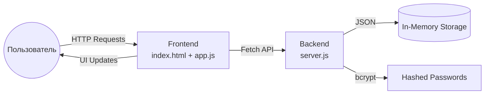

# 🔐 Password Manager

[](https://opensource.org/licenses/MIT)
[](https://nodejs.org)
[]()

Веб-приложение для генерации криптографически стойких паролей и их локального хранения. Разработано в рамках курса по веб-разработке для отработки навыков работы с Git, PR, клиент-серверной архитектурой и обработки обратной связи.

---

##  Цель проекта

1. **Образовательная:** Закрепить навыки работы с Git (ветвление, коммиты, Pull Request), настройки клиент-серверного взаимодействия и проектирования REST API.
2. **Продуктовая:** Предоставить пользователю удобный инструмент для создания сложных паролей и их быстрого сохранения без использования сторонних облачных сервисов.
3. **Инженерная:** Реализовать чёткое разделение ответственности между Frontend и Backend, настроить обработку ошибок и валидацию данных.

---

## 📋 Описание задачи

Современные пользователи сталкиваются с проблемой переиспользования простых паролей на разных сервисах, что снижает общую безопасность. Данное приложение решает задачу **локальной генерации и структурированного хранения** учётных данных с акцентом на приватность (данные не покидают локальный сервер).

### 👤 Пользовательские сценарии
- Генерация пароля с настраиваемой длиной и набором символов
- Визуальная оценка надёжности пароля в реальном времени
- Сохранение пароля с привязкой к сервису (название, логин, заметки)
- Просмотр, копирование и удаление записей из хранилища
- Мгновенное уведомление об успешных действиях или ошибках

---

## ✨ Функционал

| Модуль | Возможности |
|--------|-------------|
| 🎲 Генератор | Настройка длины (4-64), выбор типов символов (A-Z, a-z, 0-9, спецсимволы), криптографически стойкий рандом (`crypto.randomInt`) |
|  Анализатор | Динамический индикатор надёжности (Слабый/Средний/Надёжный) с цветовой кодировкой |
| 🗄️ Хранилище | CRUD-операции, валидация обязательных полей, скрытие паролей в списке, быстрое копирование |
| 🔔 Уведомления | Toast-система для отображения результатов действий (успех/ошибка) |
|  Адаптивность | Корректное отображение на десктопах, планшетах и мобильных устройствах |

---

##  Технологический стек

| Слой | Технология | Обоснование выбора |
|------|------------|-------------------|
| **Backend** | Node.js + Express | Лёгкий, асинхронный, идеален для REST API и учебных проектов |
| **Безопасность** | `bcryptjs` | Хеширование паролей перед сохранением (даже в демо-режиме демонстрирует best practice) |
| **Frontend** | Vanilla JS + HTML5 + CSS3 | Отсутствие зависимостей фреймворков позволяет глубже понять работу DOM, Fetch API и событийной модели |
| **Стилизация** | CSS Variables, Flexbox/Grid, CSS Animations | Современный подход к адаптивной вёрстке без препроцессоров |
| **Инструменты** | Git, GitHub PR, npm | Стандартная экосистема разработки и код-ревью |

---

## 🏗 Архитектура приложения

Проект построен по классической **Client-Server архитектуре** с чётким разделением ответственности:



###  API Справочник

| Метод | Endpoint | Описание | Тело запроса | Ответ |
|-------|----------|----------|--------------|-------|
| `POST` | `/api/generate` | Генерация пароля | `{length, useUppercase, ...}` | `{password, strength}` |
| `POST` | `/api/vault` | Сохранение записи | `{title, username, password, notes}` | `{message, password}` |
| `GET`  | `/api/vault` | Получить все записи | — | `Array<{id, title, ...}>` |
| `GET`  | `/api/vault/:id/plain` | Показать пароль | — | `{password}` |
| `DELETE` | `/api/vault/:id` | Удалить запись | — | `{message}` |
| `GET`  | `/api/health` | Статус сервера | — | `{status: "ok"}` |

---

## 🚀 Инструкция по запуску

###  Требования
- Node.js `v18+`
- npm (входит в состав Node.js)
- Современный браузер (Chrome, Firefox, Safari, Edge)

### ⚙️ Установка и запуск

1. **Клонирование репозитория**
   ```bash
   git clone <URL-РЕПОЗИТОРИЯ>
   cd password-manager
   ```

2. **Установка зависимостей Backend**
   ```bash
   cd backend
   npm install
   ```

3. **Запуск сервера**
   ```bash
   npm start
   ```
   Сервер запустится на `http://localhost:3000`

4. **Запуск Frontend**
   - Вариант A: Откройте `frontend/index.html` в браузере напрямую
   - Вариант B (рекомендуется): Используйте расширение **Live Server** в VS Code для работы без CORS-ограничений

5. **Проверка работоспособности**
   Перейдите по адресу `http://localhost:3000/api/health` — должен вернуться JSON со статусом `"ok"`.

###  Troubleshooting
| Проблема | Решение |
|----------|---------|
| `500 Internal Server Error` при генерации | Убедитесь, что в `server.js` подключён модуль `const crypto = require('crypto');` |
| CORS ошибка в консоли | Открывайте фронтенд через Live Server, а не как `file://` |
| Кнопки в хранилище не работают | Обновите страницу, функции экспортированы в `window` для совместимости |

---

## 🔒 Безопасность и ограничения

- ✅ Пароли хешируются алгоритмом `bcrypt` с `saltRounds=10`
- ✅ Генерация использует `crypto.randomInt()` (криптографически стойкий ГПСЧ)
- ✅ Валидация входных данных на сервере и клиенте
- ⚠️ **Ограничение демо-версии:** Данные хранятся в оперативной памяти (`in-memory array`). После перезапуска сервера хранилище очищается. Для production рекомендуется интеграция с PostgreSQL/MongoDB и добавление мастер-пароля.

---

## 📈 Планы развития (Roadmap)

- [ ] Интеграция с SQLite/PostgreSQL для персистентного хранения
- [ ] Аутентификация по мастер-паролю с JWT
- [ ] Экспорт/импорт данных в формате `.csv` и `.json`
- [ ] Проверка утечек паролей через HaveIBeenPwned API
- [ ] Покрытие кода тестами (Jest + Supertest)
- [ ] Docker-контейнеризация и `docker-compose` для развёртывания

---

## 🔄 Работа с Git и Pull Request

Проект создан с соблюдением workflow, требуемого заданием:
1. Идея и архитектура описаны в `README.md` до начала реализации
2. Создан отдельный Pull Request с описанием изменений
3. В коде оставлены осмысленные комментарии для облегчения код-ревью
4. Обратная связь от проверяющих будет учтена и зафиксирована в коммитах с префиксом `fix:` или `feat:`

---

## 👨‍🎓 Автор

Студенческий проект в рамках дисциплины *«Введение в специальность»*.  
Код написан с акцентом на читаемость, модульность и соответствие стандартам ESLint/Prettier.

📄 **Лицензия:** MIT — свободное использование в образовательных целях.
